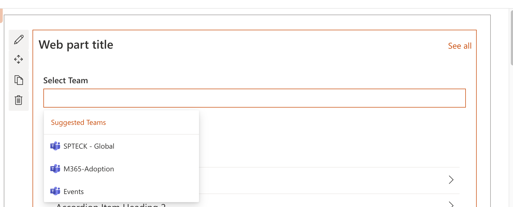

# TeamPicker control

This control allows you to select one or multiple Teams based on user's permissions.

Here is an example of the control:


`SelectTeamPicker` single selection mode:




## How to use this control in your solutions

- Check that you installed the `@pnp/spfx-controls-react` dependency. Check out the [getting started](../../#getting-started) page for more information about installing the dependency.
- Import the control into your component:

```TypeScript
import { SelectTeamPicker } from "@pnp/spfx-controls-react/lib/TeamPicker";
```

- Use the `SelectTeamPicker` control in your code as follows:

```TypeScript
<TeamPicker   label="Select Team"
                    selectedTeams={selectedTeams}
                    appcontext={webpartContext}
                    itemLimit={1}
                    onSelectedTeams={_onSelectedTeams}/>
```

- The `_onSelectedTeams` change event returns the team(s) and can be implemented as follows:

```TypeScript
const _onSelectedTeams ((tagList: ITag[]) => {
              console.log(tagList);
      }
```

## Implementation


The `TeamPicker` control can be configured with the following properties:

| Property | Type | Required | Description |
| ---- | ---- | ---- | ---- |
| appcontext | WebPartContext \| ExtensionContext | yes | The context object of the SPFx loaded webpart or customizer. |
| selectedTeams | ITag[] | yes | Array with Selected Teams  |
| itemLimit | number | no | number of allowed selected items |
| label | string | no | Label of Picker |
| styles | IBasePickerStyles | no | Customer Styles of Picker |
| onSelectedTeams: | (tagsList:ITag[]) => void; | yes | callBack with teams Selected |


 ## MSGraph Permissions required

This control required the flowing scopes :

at least : Team.ReadBasic.All, Channel.ReadBasic.All,
